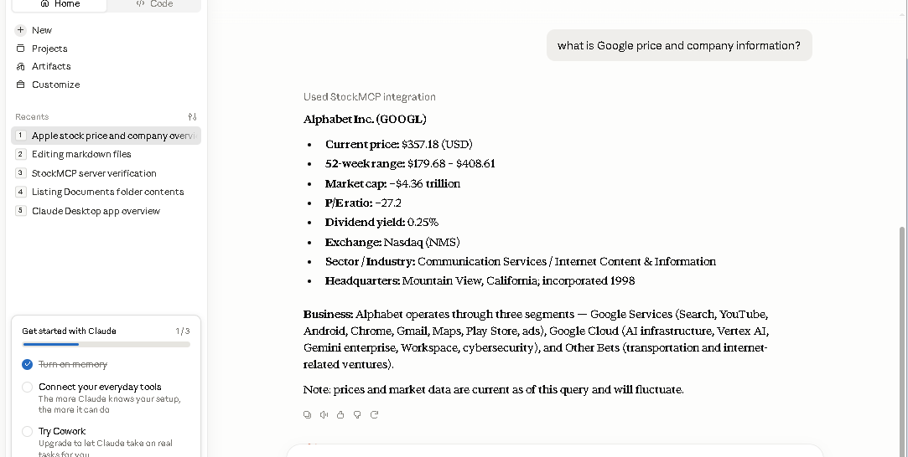

# StockMCP


StockMCP is an MCP (Model Context Protocol) server that allows AI assistants such as Claude Desktop and Cursor to retrieve real-time US stock market information through structured tools.

StockMCP provides stock prices, historical data, company information, market data, and financial news through MCP tools that can be used by Claude Desktop, Cursor, and other MCP-compatible AI clients.

```
Claude Desktop
        │
        │ MCP
        ▼
+----------------------+
|      StockMCP        |
|----------------------|
| stock_price()        |
| stock_history()      |
| stock_news()         |
| company_info()         |
| market_status()      |
+----------------------+
        │
        ▼
 Yahoo Finance
```

## Features
- Real-time stock prices
- Historical OHLCV data
- Company information
- Market capitalization
- Valuation metrics
- Financial news
- Market overview
- AI-ready MCP tools

## Available Tools
| Tool | Description |
|------|-------------|
| `stock_price()` | Latest stock price |
| `stock_history()` | Historical OHLCV data |
| `stock_info()` | Company information |
| `stock_news()` | Latest financial news |
| `market_status()` | Market index information |

## Supported AI Clients

| Client         | Supported |
|----------------|-----------|
| Claude Desktop | ✅        |
| Cursor         | ✅        |
| VS Code + MCP  | Planned   |
| Windsurf       | Planned   |

## Quick Start

### Requirements
- Python 3.11+

Dependencies:
- MCP
- yfinance

---

### Clone the Repository
```bash
git clone https://github.com/byronguo/StockMCP.git
cd StockMCP
```

### Create Virtual Environment
```bash
python -m venv .venv
Set-ExecutionPolicy -Scope CurrentUser RemoteSigned
```

Activate it:

**Windows:**
```bash
.venv\Scripts\activate
```

**macOS/Linux:**
```bash
source .venv/bin/activate
```

### Install Dependencies
```bash
pip install -r requirements.txt
```

### Run StockMCP Server
```bash
python server.py
```

### Claude Desktop Configuration
```json
{
  "mcpServers": {
    "stock": {
      "command": "python",
      "args": [
        "C:\\MCP_Claude\\StockMCP\\server.py"
      ]
    }
  }
}
```
Restart Claude Desktop.

### Test


### Cursor Configuration
Same configuration as Claude Desktop.

## Available Tools
- `stock_price()`
- `company_info()`
- `market_cap()`
- `pe_ratio()`
- `ps_ratio()`
- `financials()`
- `option_chain()`
- `news()`

## Roadmap
v0.1
- stock server

v0.2
- refactored architecture
- company
- market
- news

- [x] Stock price
- [x] Historical data
- [x] Company information
- [x] Market data
- [x] Stock news

Upcoming:
- [ ] Financial statements
- [ ] Options chain
- [ ] Technical indicators
- [ ] AI stock analysis

## Topics
`mcp` `claude` `cursor` `stock` `finance` `ai` `python` `yfinance`