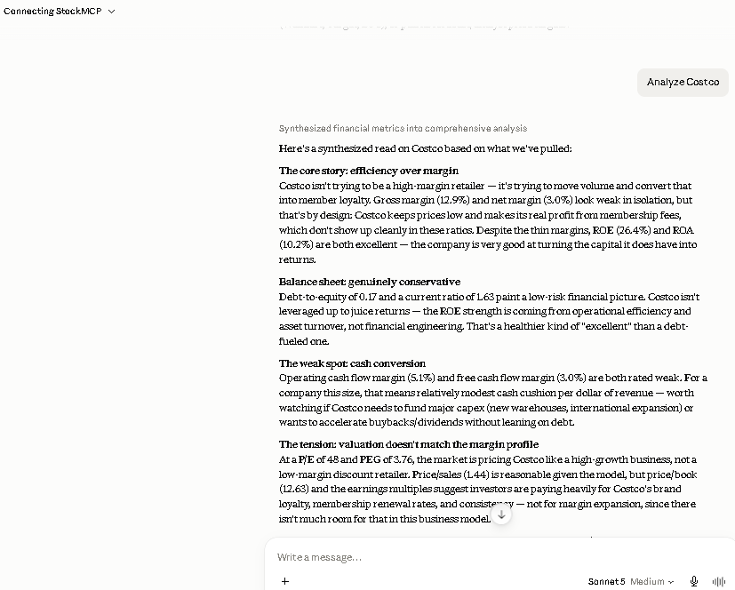
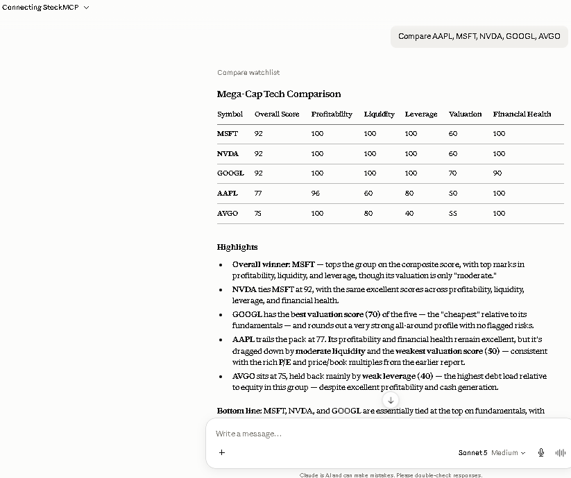
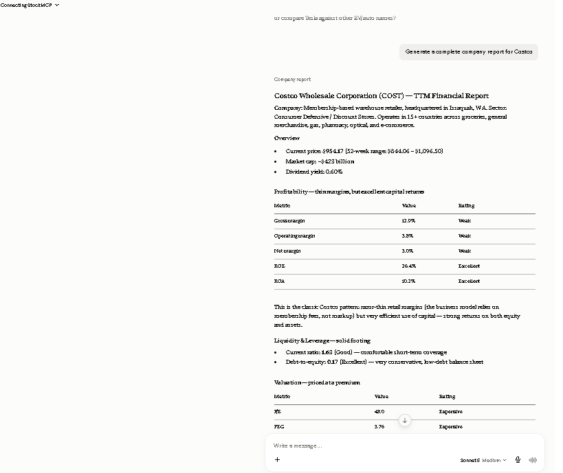
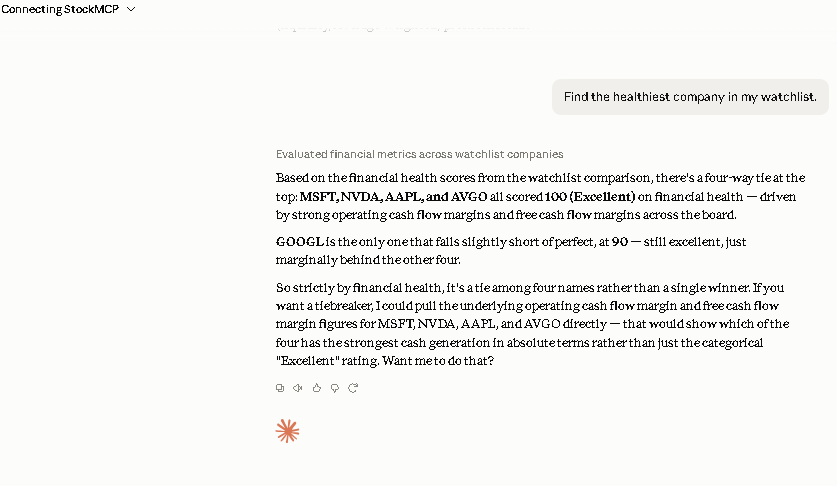
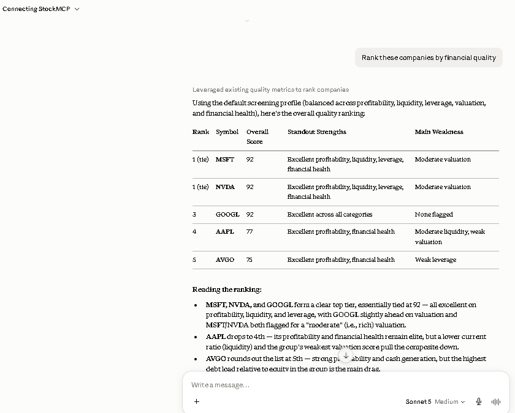
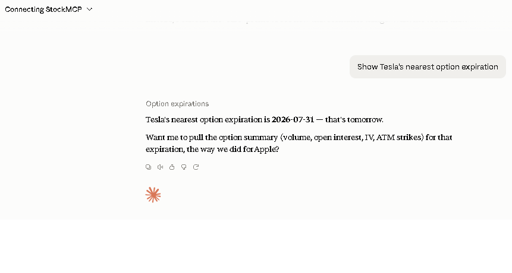
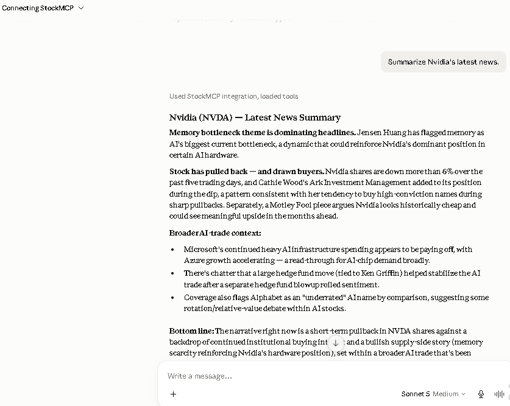
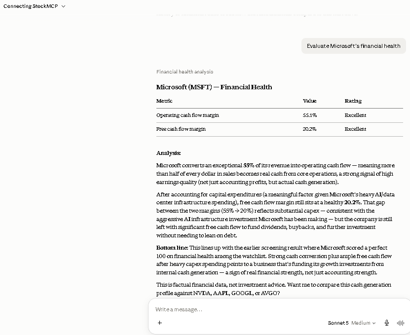
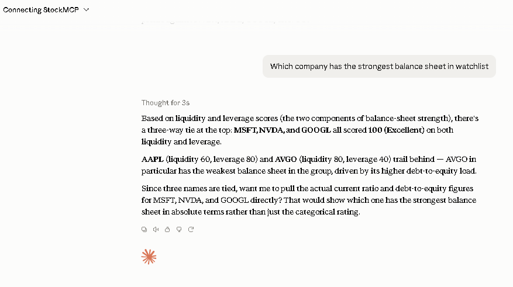
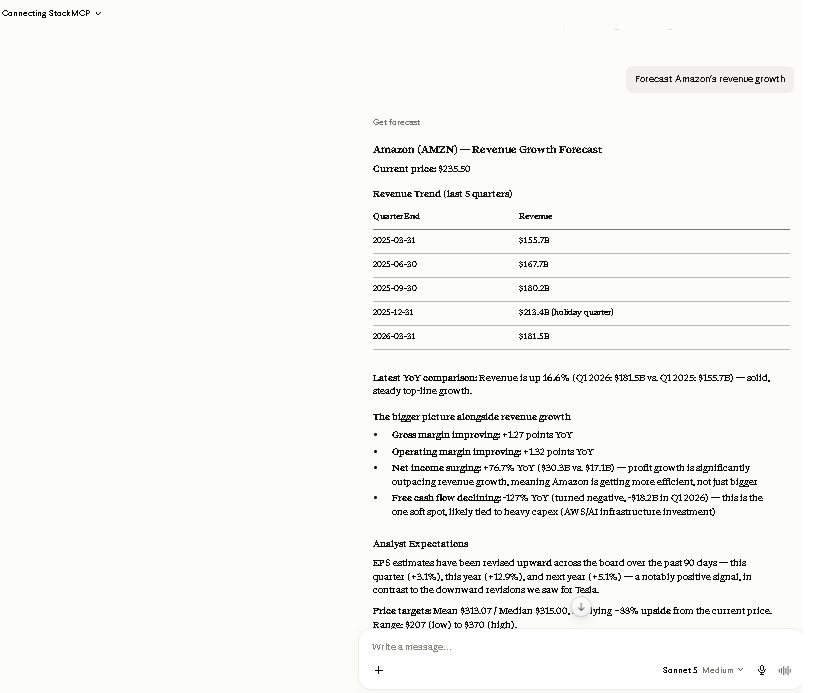

# StockMCP
> AI-Powered Stock Market Analysis MCP Server


## Badges


## Introduction
StockMCP is an open-source **Model Context Protocol (MCP)** server that enables AI assistants such as Claude Desktop and Cursor to access real-time U.S. stock market data through a rich set of financial analysis tools.

StockMCP combines market data, SEC filings, company fundamentals, valuation metrics, analyst forecasts, options data, financial health analysis, and watchlist screening into one unified MCP server.

It is designed for AI-powered investment research using Claude Desktop, Cursor, and other MCP-compatible AI clients.


## Current Version

StockMCP v1.0

Initial stable release including:
- Financial analysis
- Company reports
- Watchlist screening
- Forecasts
- Options analysis


## Highlights
- Real-time U.S. stock market data
- SEC financial statements (up to 8 quarters)
- Comprehensive company reports
- Financial ratio and TTM analysis
- Profitability, liquidity, leverage, valuation and financial health scoring
- Automated company comparison and ranking
- Watchlist screening and ranking
- Analyst forecasts
- Options chain and implied volatility
- AI-ready tools for Claude Desktop, Cursor and other MCP clients


## Features

### Market Data
- Real-time stock prices
- Historical price data
- Company information

### Financial Analysis
- SEC quarterly financial statements
- TTM income statement, balance sheet and cash flow
- Financial ratios
- Financial health scoring and analysis

### Investment Research
- Company reports
- Stock comparison
- Watchlist screening
- Analyst forecasts

### Options Analysis
- Option expiration dates
- Calls and puts
- Implied volatility
- Open interest analysis


## Supported AI Clients

| Client         | Supported |
|----------------|-----------|
| Claude Desktop | ✅        |
| Cursor         | ✅        |
| VS Code + MCP  | Planned   |
| Windsurf       | Planned   |


## Quick Start

### Install

```bash
git clone https://github.com/guobo2421-ui/StockMCP.git
cd StockMCP

python -m venv .venv

# Windows
.venv\Scripts\activate

# macOS / Linux
source .venv/bin/activate

pip install -r requirements.txt

python server.py
```


## Example AI Queries

**Analyze Costco's financial health.**



**Compare Apple, Microsoft, Nvidia, Google and Broadcom.**



**Generate a complete company report for Costco.**



**Find the healthiest company in my watchlist.**



**Rank these companies by financial quality.**



**Show Tesla's nearest option expiration.**



**Summarize Nvidia's latest news.**



**Evaluate Microsoft's financial health.**



**Which company has the strongest balance sheet?**



**Forecast Amazon's revenue and earnings.**




## Documentation

- 📦 [Installation Guide](docs/INSTALL.md)
- 🛠️ [Available Tools](docs/TOOLS.md)
- 👨‍💻 [Development Guide](docs/DEVELOPMENT.md)
- 📊 [Financial Analysis Guide](docs/FINANCIAL_ANALYSIS.md)
- 📝 [Changelog](CHANGELOG.md)


## Architecture Diagram
```text
                         ┌─────────────────────┐
                         │   AI Clients        │
                         │ Claude / Cursor     │
                         └──────────┬──────────┘
                                    │
                                    ▼
                         ┌─────────────────────┐
                         │     server.py       │
                         │  MCP Server Entry   │
                         │                     │
                         │  imports tools/*    │
                         └──────────┬──────────┘
                                    │
                                    ▼
              ┌────────────────────────────────────────┐
              │              tools/                    │
              │          MCP Tool Layer                │
              │                                        │
              │  stock.py        company.py            │
              │  financials.py   forecast.py           │
              │  market.py       news.py               │
              │  options.py      screening.py          │
              │  watchlist.py                          │                           
              │                                        │
              │  @mcp.tool()                           │
              └──────────────────┬─────────────────────┘
                                 │
                                 ▼
              ┌──────────────────────────────────────────┐
              │             services/                    │
              │          Business Logic Layer            │
              │                                          │
              │  yahoo.py           market_data.py       │
              │  financial_data.py  financial_ttm.py     │
              │  forecast_data.py   sec_financial_data.py│
              │                                          │
              │  Data retrieval                          │
              │  Calculations                            │
              │  Financial analysis                      │
              └──────────────────┬───────────────────────┘
                                 │
                    ┌────────────┼────────────┐
                    ▼            ▼            ▼
             ┌──────────┐ ┌──────────┐ ┌──────────┐
             │ Yahoo    │ │ SEC      │ │ Other    │
             │ Finance  │ │ Company  │ │ API      │
             │          │ │ Facts    │ │          │
             └──────────┘ └──────────┘ └──────────┘
```


## Data Sources

StockMCP uses:

- Yahoo Finance for market data and price information
- SEC CompanyFacts API for financial statements
- Analyst estimates for forecasts
- Options market data for derivatives analysis


## Configuration

Some advanced features may require API configuration depending on the selected data providers.

See:

- docs/INSTALL.md
- docs/DEVELOPMENT.md

for environment variables and setup details.


## Development

See the Development Guide for:

- Project structure
- Adding new MCP tools
- Extending financial analysis modules
- Running tests


## Roadmap

### Completed

- ✅ Real-time market data
- ✅ Company fundamentals
- ✅ SEC financial statements
- ✅ Financial ratios
- ✅ Financial health analysis
- ✅ Company reports
- ✅ Watchlist screening and financial ranking
- ✅ Analyst forecasts
- ✅ Options analysis

### Planned

- Technical indicators
- Portfolio analysis
- ETF analysis
- Dividend analysis
- Economic indicators
- Insider trading analysis


## License
StockMCP is released under the MIT License.


