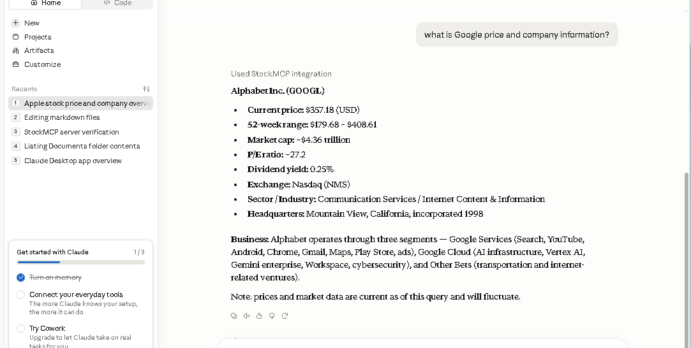

# Installation

This guide explains how to install and configure StockMCP for use with MCP-compatible AI clients such as Claude Desktop and Cursor.


## Requirements

- Python 3.11 or later
- Git
- Internet connection

Key Python dependencies:

- FastMCP
- yfinance
- requests


## Clone the Repository
```bash
git clone https://github.com/guobo2421-ui/StockMCP.git
cd StockMCP
```

## Create Virtual Environment
```bash
python -m venv .venv
```

### Windows (PowerShell)

If PowerShell blocks script execution, run:

```powershell
Set-ExecutionPolicy -Scope CurrentUser RemoteSigned
```

Activate it:
**Windows:**
```bash
.venv\Scripts\activate
```

**macOS/Linux:**
```bash
source .venv/bin/activate
```

## Install Dependencies
```bash
pip install --upgrade pip
pip install -r requirements.txt
```

## Run StockMCP Server
```bash
python server.py
```

## Claude Desktop Configuration
Add the following configuration to claude_desktop_config.json
```json
{
  "mcpServers": {
    "filesystem": {
      "command": "npx",
      "args": [
        "-y",
        "@modelcontextprotocol/server-filesystem",
        "C:\\MCP_Claude"
      ]
    },
    "StockMCP": {
      "command": "C:\\Python314\\python.exe",
      "args": [
        "C:\\MCP_Claude\\StockMCP\\server.py"
      ]
    }
  }
  ...
}
```
Restart Claude Desktop after saving the configuration file.

## Verify Installation
If the configuration is correct, Claude Desktop should display the StockMCP server and its available tools.




## Cursor Configuration
Add the following configuration to mcp.json
```json
{
  "mcpServers": {
    "filesystem": {
      "command": "npx",
      "args": [
        "-y",
        "@modelcontextprotocol/server-filesystem",
        "C:\\MCP_Claude"
      ]
    }    
  },
  "StockMCP": {
    "command": "python",
    "args": [
      "C:\\MCP_Claude\\StockMCP\\server.py"
    ]
  }
}
```
Restart Cursor after saving the configuration file.


## Next Steps

After installation, you can:

- Read the Available Tools guide [Available Tools](TOOLS.md)
- Explore the Development Guide [Development Guide](DEVELOPMENT.md)
- Try the example prompts in the README [README](../README.md)


